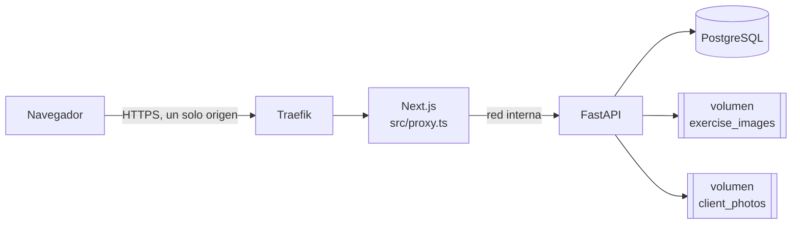
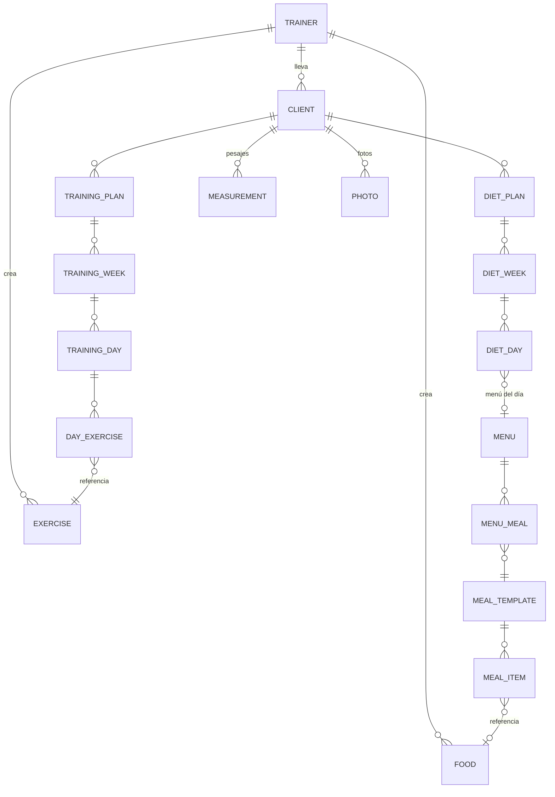

# JOSEMA RB

Plataforma para que un entrenador personal lleve a sus clientes: rutinas, dietas,
seguimiento del físico y entrega de todo en PDF o Word.

No es un SaaS ni pretende serlo. Es la herramienta de trabajo de **un** entrenador:
un solo usuario, sus clientes y sus planes, sin registro público ni multiempresa.

En producción: **https://josema.fholk.com**

---

## Qué hace

**Clientes**
Ficha con datos de contacto (pulsables desde el móvil: email, teléfono y WhatsApp),
objetivos y notas. Baja sin pérdida: desactivar un cliente conserva todo su historial.

**Entrenamiento**
Librería de **873 ejercicios** traducidos al español con imágenes, más los que el
entrenador añada con su propia foto. Los planes se estructuran en plan → semanas →
días → ejercicios, con series, repeticiones, descanso, tempo y superseries. Una semana
se duplica en un clic y los días sin ejercicios son descanso, sin más.

**Dieta**
Catálogo de **605 alimentos** con ficha nutricional completa de etiqueta europea
(calorías, proteína, hidratos, azúcares, grasas, saturadas, fibra y sal). Los alimentos
se agrupan en comidas reutilizables y estas en menús de día, que se asignan a los días
de la semana de golpe. Las macros se calculan solas al indicar la cantidad real
("150 g", "2 unidades") y se guardan como foto fija: editar un alimento después no
altera los menús ya montados.

**Seguimiento corporal**
Historial de pesajes con IMC y gráfica de evolución, y fotos de progreso frontal,
lateral y trasera por fecha, con galería y un comparador que enfrenta dos momentos
pose con pose, mostrando bajo cada foto el peso de ese día.

**Entrega al cliente**
Cualquier plan de entrenamiento o dieta se descarga en PDF o Word, con las imágenes
de los ejercicios y los totales de macros por comida y por día.

---

## Arquitectura

Todo vive detrás de **un único dominio**. El navegador solo habla con el frontend, que
reenvía `/api` y `/static` al backend por la red interna de Docker.



Esa decisión es la que sostiene el resto: como no hay cambio de origen, la cookie de
sesión (`httpOnly`, `Secure`) viaja sola en cada petición, no hace falta CORS ni
`SameSite=None`, y un `` se autentica sin escribir una línea
de JavaScript.

El proxy vive en `frontend/src/proxy.ts` (el middleware de Next 16) y **no** en
`rewrites()` de `next.config.ts`: los rewrites se evalúan al construir la imagen, así
que el destino se quedaba congelado dentro del contenedor.

### Stack

| Capa            | Tecnología                                                                               |
| --------------- | ---------------------------------------------------------------------------------------- |
| Backend         | FastAPI · SQLAlchemy 2 · Alembic · Pydantic v2 · uv                                      |
| Frontend        | Next.js 16 (App Router) · TypeScript · Tailwind v4 · React Query · React Hook Form + Zod |
| Base de datos   | PostgreSQL 16                                                                            |
| Documentos      | WeasyPrint (PDF) · python-docx (Word)                                                    |
| Imágenes        | Pillow                                                                                   |
| Infraestructura | Docker Compose · Dokploy · Traefik                                                       |

En números: **59 endpoints**, **17 tablas**, 5 migraciones y ~18.000 líneas entre
`backend/app` y `frontend/src`.

---

## Modelo de datos



Dos ideas que explican el diagrama:

- **Los menús son reutilizables.** Un día de dieta no contiene comidas: apunta a un
  menú. "El mismo menú toda la semana" es el mismo `menu_id` siete veces.
- **Las macros se copian, no se calculan en vivo.** Cada línea de una comida guarda
  sus valores en el momento de crearla, así que corregir un alimento no reescribe
  dietas ya entregadas.

---

## Puesta en marcha

Requisitos: Docker y, para trabajar en el código, [uv](https://docs.astral.sh/uv/) y
Node 20+.

### Todo en Docker

```bash
docker compose up -d --build
```

El contenedor del backend, al arrancar, aplica las migraciones y siembra los 873
ejercicios, la cuenta del entrenador y los 605 alimentos. Los tres pasos son
idempotentes: reiniciar no duplica nada.

| Servicio   | URL                                    |
| ---------- | -------------------------------------- |
| Frontend   | http://localhost:3001                  |
| API        | http://localhost:8001/docs             |
| PostgreSQL | `localhost:5432` (`josema` / `josema`) |

Credenciales de desarrollo: **`trainer@example.com`** / **`change-me`**.

### Desarrollo con recarga en caliente

```bash
docker compose up -d db                 # solo la base de datos

cd backend
uv sync
uv run alembic upgrade head
uv run python -m scripts.seed_exercises # y seed_trainer, seed_foods
uv run uvicorn app.main:app --reload --port 8000

cd frontend
npm install
BACKEND_URL=http://localhost:8000 npm run dev
```

> Los scripts de `backend/scripts/` se ejecutan **como módulo**
> (`python -m scripts.seed_trainer`), nunca como archivo suelto: importan de `app.` y
> necesitan `backend/` en el `PYTHONPATH`.

---

## Comandos

```bash
# Backend
uv run pytest                 # 61 tests
uv run ruff check .
uv run alembic upgrade head
uv run alembic revision -m "..."

# Frontend
npm run test                  # 115 tests
npm run lint
npm run build
npx tsc --noEmit
```

Los tests de backend necesitan PostgreSQL levantado: cada test corre dentro de una
transacción que se revierte al terminar, así que no ensucian la base.

Tres tests de exportación a PDF se saltan solos en máquinas sin las librerías nativas
de WeasyPrint (Pango, Cairo), que en Windows no están de serie. No es un fallo.

---

## Despliegue

Se despliega en **Dokploy** desde `docker-compose.prod.yml`. Cada push a `main` lanza
el despliegue automáticamente a través de la integración con GitHub.

Diferencias con el compose de desarrollo:

- Sin puertos publicados: Traefik llega por la red de Docker, y los puertos del host
  chocarían con los otros proyectos del servidor.
- `COOKIE_SECURE=true`, porque Traefik termina el TLS.
- Los secretos vienen del entorno, sin valores por defecto:
  `POSTGRES_PASSWORD`, `JWT_SECRET`, `TRAINER_EMAIL`, `TRAINER_PASSWORD`.
- Tres volúmenes que deben sobrevivir a cualquier redespliegue: `pgdata`,
  `exercise_images` (fotos que sube el entrenador) y `client_photos` (fotos de
  progreso, irremplazables).

Solo el frontend necesita dominio. Las migraciones y los seeds se aplican al arrancar
el contenedor, así que desplegar es empujar a `main` y esperar.

---

## Copias de seguridad

Las programa **Dokploy**, contra un **MinIO que corre en el mismo servidor** como
destino S3 (`docs/infra/minio-backups.yml`). De cada cosa se guarda **una copia diaria
y una semanal**, y cada nueva sustituye a la anterior: nunca se acumulan.

| Qué                                                | Cuándo                   |
| -------------------------------------------------- | ------------------------ |
| Base de datos (`pg_dump` del servicio `josema-db`) | 4:00 diario · lunes 4:30 |
| Fotos de progreso (`client_photos`)                | 5:00 diario · lunes 5:30 |
| Fotos de ejercicios (`exercise_images`)            | 5:10 diario · lunes 5:40 |

Además, a demanda:

```bash
./scripts/backup.sh now        # copia inmediata, antes de tocar algo delicado
./scripts/backup.sh list       # qué hay guardado ahora mismo
./scripts/backup.sh download   # trae las copias a ./backups/
```

**Para restaurar la base de datos**, el fichero es formato _custom_ de `pg_dump`
aunque se llame `.sql.gz`, así que `psql` lo rechaza y hay que usar `pg_restore`:

```bash
gunzip -c <fichero>.sql.gz > dump.pgc
pg_restore -U josema -d josema_rb --no-owner dump.pgc
```

Probado de verdad: restaurando la copia en un PostgreSQL limpio vuelven los 873
ejercicios, los alimentos, los clientes, los pesajes y las fotos, sin un solo error.

**Limitación que conviene tener presente**: al vivir en el mismo servidor, estas
copias protegen de un borrado accidental o de una migración mal aplicada, pero **no
de la pérdida del disco**. Para eso habría que apuntar el destino a un S3 externo,
que se configura igual cambiando solo el destino en Dokploy.

---

## Decisiones que conviene conocer antes de tocar nada

Casi todas nacieron de un problema real en producción.

**Los servicios del compose llevan prefijo (`josema-db`, `josema-backend`, …).**
Dokploy conecta todos los stacks del servidor a la misma red compartida, así que un
nombre genérico como `backend` resuelve al contenedor de **otro** proyecto que
registrase ese alias antes. Pasó: el frontend acabó hablando con el backend de otro
proyecto y toda la API devolvía 404.

**El frontend fija `HOSTNAME=0.0.0.0` en su Dockerfile.**
El servidor standalone de Next escucha en `$HOSTNAME`, y Docker inyecta ahí el id del
contenedor. Ese nombre resuelve a una sola IP, de modo que el contenedor atendía por
una de sus dos redes y dejaba muda la otra, justo por la que entra Traefik: Bad Gateway
con la aplicación perfectamente viva.

**WeasyPrint se importa dentro de la función, no al principio del módulo.**
Enlaza con librerías nativas que en Windows no existen; con un import normal, arrancar
la aplicación (y por tanto toda la suite de tests) fallaría en local.

**El IMC no se guarda en la base de datos.**
Se deriva de la altura del cliente al leer, así que corregir una altura mal apuntada
arregla el histórico entero de una vez.

**Las fotos de los clientes viven fuera de `app/static`.**
Ese directorio se sirve sin pedir sesión. Las fotos corporales salen por un endpoint
autenticado, se redimensionan a 1600 px y se les borran los metadatos EXIF, que
incluyen las coordenadas GPS de dónde se tomó la foto.

**Los ejercicios importados están protegidos; los alimentos precargados no.**
Editar o borrar un ejercicio de la librería base devuelve 403. Los 605 alimentos
sembrados, en cambio, son del entrenador y puede tocarlos libremente: fue una decisión
expresa de producto.

**La contraseña usa `bcrypt` directamente, sin `passlib`.**
`passlib` está sin mantenimiento y es incompatible con bcrypt ≥ 4.1.

---

## Estructura

```
backend/
├── app/
│   ├── api/            # routers FastAPI
│   ├── core/           # configuración, seguridad, sesión de BD
│   ├── models/         # SQLAlchemy
│   ├── schemas/        # Pydantic
│   ├── repositories/   # acceso a datos
│   ├── services/       # lógica de negocio
│   ├── templates/pdf/  # plantillas de los documentos
│   ├── alembic/        # migraciones
│   └── tests/
└── scripts/            # seeds e importación de datos

frontend/src/
├── app/                # rutas (App Router)
├── components/         # UI por dominio
├── hooks/              # React Query
├── lib/                # cliente HTTP y lógica pura (con sus tests)
├── types/
└── proxy.ts            # middleware: reenvía /api y /static al backend
```

La lógica que merece la pena probar vive en `frontend/src/lib/` como funciones puras
—borradores de semana, cálculo de macros, agrupación de fotos, evolución del peso— y
los componentes solo la llaman. Por eso hay tests de frontend que no montan ni un
componente.
